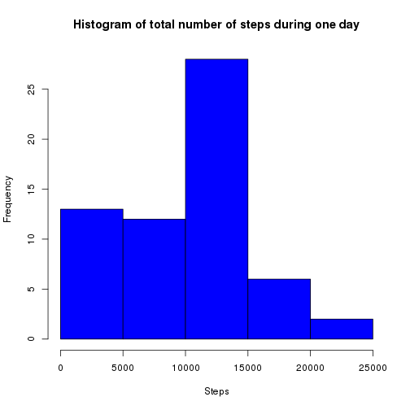
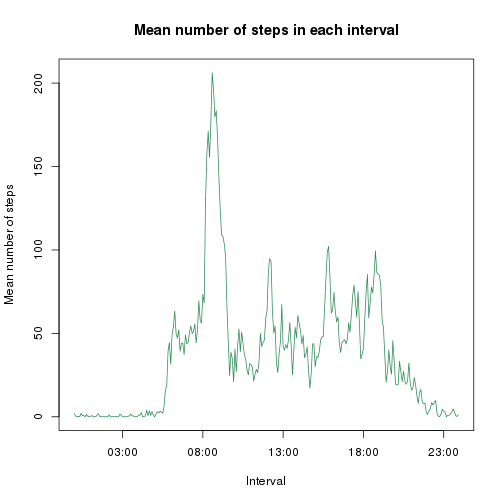
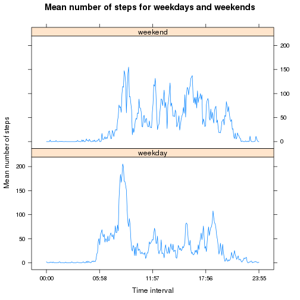

<br><br>


## Loading and preprocessing the data

First of all the data has to be downloaded. All data can be downloaded from 
[here](https://d396qusza40orc.cloudfront.net/repdata%2Fdata%2Factivity.zip).


```r
url <- "https://d396qusza40orc.cloudfront.net/repdata%2Fdata%2Factivity.zip"
if (!file.exists("activity.zip")){
        download.file(url,"activity.zip",method = "curl")
}
```

All data is then unpacked and loaded into R. The step and interval colums will
consist of numeric values while the date column consist of values of the Date
class. 


```r
unzip("activity.zip")
activity <- read.csv("activity.csv",
                     colClasses = c("numeric","Date","numeric"))
```

The dplyr package will be needed to transform the data and in the
following anlyses. This package is therefore loaded.
The times in the dataframe is stored as three to four digits there the
first ones is the hour and the last two is the minutes. The following code will
transform the intervall into a time objoct instead.


```r
library(dplyr)
```


```r
activity <- mutate(activity,interval = as.POSIXct(strptime(
        paste(interval%/%100,interval %% 100,sep=':'),"%H:%M")))
```


## What is mean total number of steps taken per day?

To answer this question the total number of steps will be calculated for each
day and a histogram of the result will be created.
When answering this question all missing values will be ignored.


```r
data <- activity %>%
        group_by(date) %>%
        summarise(totalSteps = sum(steps,na.rm=TRUE))
hist(data$totalSteps,col="blue",
     xlab = "Steps",
     main = "Histogram of total number of steps during one day")
```

 

From this histogram one can conclude that it is most common that between 10000
and 15000 steps will be taken during one day.
The mean and median for the number of is then calculated with the following code.


```r
meanSteps <- mean(data$totalSteps)
medianSteps <- median(data$totalSteps)
```

The found **mean was 9354.23** and the
**median was10395.**
Comparing with the histogram both these values seems reasonable.


<br><br>


## What is the average daily activity pattern?

To answer this question a line plot for the mean number of steps for each time
intervall is created. The plot is created with the following code.


```r
data <- activity %>%
        group_by(interval) %>%
        summarise(meanSteps = mean(steps,na.rm=TRUE))

plot(data,type="l", ylab="Mean number of steps", xlab = "Interval",
     main="Mean number of steps in each interval",col="seagreen")
```

 


The interval with the maximum number of steps is then found with this code.


```r
maxInterval <- data$interval[which.max(data$meanSteps)]
```


** The interval with the maximum mean number of steps was the interval that starts at 08:35**. This value agrees with the plot.


<br><br>


## Imputing missing values


The number of rows in the activity dataset that contains missing values is


```r
sum(!complete.cases(activity))
```

```
## [1] 2304
```

To impute the missing values the scheme were all missing values are replaced
with the median of that interval over all days was selected.
The new dataset with filled in missing values is stored in a variable called
activityNoMissing.


```r
medians <- activity %>%
        group_by(interval) %>%
        summarise(median = median(steps,na.rm=TRUE))

data <- merge(activity, medians, by="interval")
missing <- is.na(data$steps)
data$steps[missing] <- data$median[missing]

activityNoMissing <- select(data,steps,date,interval)
```


The same histogram that was created for the data with missing values is now
created for the new dataset with imputed values. The mean and median for the
total number of steps per day is also calculated.


```r
data <- activityNoMissing %>%
        group_by(date) %>%
        summarise(totalSteps = sum(steps,na.rm=TRUE))
hist(data$totalSteps,col="blue",
     xlab = "Steps",
     main = "Histogram of total number of steps during one day")
```

 


```r
meanSteps <- mean(data$totalSteps)
medianSteps <- median(data$totalSteps)
```

**The mean number of steps per day for the dataset with imputed values was 9503.87 and the median was 10395**.
The histogram looks the same as the first one. This is becouse the majority of
values is the same as before, replacing missing values have only added a few
new ones. The mean will shift slightly since some new values are added to all
days with missing values. The median stayed the same since the small change that
replacing missing values caused did not make any changes to the order of the
total steps per day.

A different scheme for imputing the missing values would result in a different
result.


## Are there differences in activity patterns between weekdays and weekends?

The first step to answer this question is to add another variable that holds
the type of day to the dataset. The mean number of steps is then calculated
for each unique combination of type of day and time interval


```r
# Add row for type of day and calculate the mean number of steps for each
#     type of day and interval
data <- activityNoMissing %>%
        mutate(dayType = as.POSIXlt(date)$wday) %>%
        mutate(dayType = as.factor(ifelse(
                dayType %in% c(0,6),"weekend","weekday"))) %>%
        group_by(dayType,interval) %>%
        summarise(meanSteps = mean(steps))
```


The mean number of steps for each time interval is then ploted for each type
of day using the lattice package.


```r
library(lattice)

# Create tics for the x-axis
xtics <- quantile(data$interval)
xlab <- format(xtics,"%H:%M")
xtics <- as.numeric(xtics)

# Create plot
p <- xyplot(meanSteps ~ interval | dayType, data=data, type="l",
            layout = c(1,2),scales = list(x = (list(labels=xlab,at=xtics))),
            main = "Mean number of steps for weekdays and weekends",
            ylab = "Mean number of steps", xlab = "Time interval")

# Print plot
print(p)
```

 


From this plot it can be concluded that the movement is more even and 
spread out on weekends than on weekdays.
